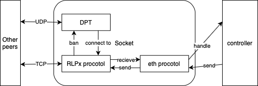

# ETHFinder

Simple Ethereum client developed with python 3.10. The project provides the basic implementation of Ethereum devp2p network, including node discovery protocol (v4/v5), rlpx protocol and eth protocol (62/63/64/65/66/67). Concurrency is achieved using asyncio and multiprocessing.  

[中文](README_cn.md) | English  

## Install

Run the following commands to install the required dependencies (recommended to work with a virtual environment, such as virtualenv/conda):  

```shell
pip install -r requirements.txt
```

## Usage

Use the dnsdisc service to parse the DNS information discovered by the ETH node.  
Example: [tests/dns_resolver.py](tests/dns_resolver.py)  

```python
from dnsdisc import resolver

# test for get 200 enrs
enrs = resolver.get_enrs(
    "enrtree://AKA3AM6LPBYEUDMVNU3BSVQJ5AD45Y7YPOHJLEF6W26QOE4VTUDPE@all.mainnet.ethdisco.net",  # url to resolve
    200  # number of iterations
)
```

Use nodedisc to participate in node discovery.  
Example:  
[tests/discv4.py](tests/discv4.py)  

Use nodedisc to participate in node discovery, and test using IPC to get ENR.  
Example:  
[tests/node_ipc.py](tests/node_ipc.py)  

Use rlpx and eth to run the RLPx protocol and the Ethereum wire protocol, note that rlpx requires nodedisc as a dependency.  
Example:  
[tests/rlpx_eth.py](tests/rlpx_eth.py)  

## Protocols list

- [x] Node Discovery Protocol v4
- [x] EIP-778: Ethereum Node Record (ENR)
- [x] ENR "eth" entry
- [x] EIP-868: Node Discovery v4 ENR Extension
- [x] EIP-1459: Discover nodes via DNS
- [x] EIP-2124: Fork identifier for chain compatibility checks
- [ ] Node Discovery Protocol v5
- [x] RLPx Protocol
- [x] Ethereum Wire Protocol 62
- [x] Ethereum Wire Protocol 63
- [x] EIP-2364: eth/64: forkid-extended protocol handshake
- [x] EIP-2464: eth/65: transaction announcements and retrievals
- [x] EIP-2976: Typed Transactions over Gossip
- [x] EIP-2481: eth/66: request identifier
- [x] EIP-4938: eth/67: Removal of GetNodeData

## Basic Architecture



## Modules List

`dnsdisc` The DNS discovery protocol module implements the resolution of the Ethereum DNS service according to the EIP-1459 specification.  
`enr` ENR module, which provides the data structure of Ethereum node records.  
`eth` The core Ethereum control module controls the behavior and messages of the Ethereum protocol, caches blocks, and records the mempool.  
`nodedisc` The node discovery protocol module includes protocol communication and DPT, among which the node discovery protocol v4 is currently implemented.  
`rlpx` rThe lpx protocol module provides a basic network communication interface based on RLPx, and currently implements the Ethernet line protocol.  
`tests` Test module, with some unit test cases.  

## Author

[XiaoHuiHui](https://github.com/XiaoHuiHui233)
