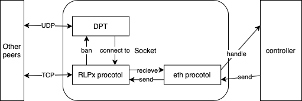

# ETHFinder

使用python 3.10开发的简易以太坊客户端，提供以太坊devp2p网络的基本实现，包括节点发现协议（v4/v5）、rlpx协议以及eth协议(62/63/64/65/66/67)。使用asyncio和multiprocessing实现并发。

中文 | [English](README.md)  

## 安装方法

运行以下指令安装所需依赖（建议配合虚拟环境，如virtualenv/conda）：  

```shell
pip install -r requirements.txt
```

## 运行用例

使用dnsdisc服务解析ETH节点发现的DNS信息。  
代码示例：[tests/dns_resolver.py](tests/dns_resolver.py)  

```python
from dnsdisc import resolver

# test for get 200 enrs
enrs = resolver.get_enrs(
    "enrtree://AKA3AM6LPBYEUDMVNU3BSVQJ5AD45Y7YPOHJLEF6W26QOE4VTUDPE@all.mainnet.ethdisco.net",  # url to resolve
    200  # number of iterations
)
```

使用nodedisc参与节点发现。  
代码示例：  
[tests/discv4.py](tests/discv4.py)  

使用nodedisc参与节点发现，并使用IPC测试获取ENR。  
代码示例：  
[tests/node_ipc.py](tests/node_ipc.py)  

使用rlpx和eth运行RLPx协议和以太坊线协议，注意rlpx需要nodedisc作为依赖。  
代码示例：  
[tests/rlpx_eth.py](tests/rlpx_eth.py)  

## 协议列表

- [x] 节点发现协议v4
- [x] EIP-778: 以太坊节点记录(ENR)
- [x] ENR "eth" 条目
- [x] EIP-868: 节点发现协议v4的ENR扩展
- [x] EIP-1459: 通过DNS发现节点
- [x] EIP-2124: 用于链兼容性检查的forkid
- [ ] 节点发现协议v5
- [x] rlpx协议
- [x] 以太坊线协议62
- [x] 以太坊线协议63
- [x] EIP-2364: 以太坊线协议64: forkid扩展协议握手
- [x] EIP-2464: 以太坊线协议65: 交易公告和检索
- [x] EIP-2976: 基于Gossip的类型化交易
- [x] EIP-2481: 以太坊线协议66: 请求标识符
- [x] EIP-4938: 以太坊线协议67: 删除GetNodeData

## 基本架构



## 模块列表

`dnsdisc` DNS发现协议模块，根据EIP-1459规范实现对以太坊DNS服务的解析。  
`enr` ENR模块，提供以太坊节点记录的数据结构。  
`eth` 核心以太坊控制模块，控制的以太坊协议的行为和消息、缓存出块，记录mempool。  
`nodedisc` 节点发现协议模块，包括协议通信和DPT，其中目前实现的是节点发现协议v4。  
`rlpx` rlpx协议模块，提供基于RLPx的基础网络通信接口，目前实现的有以太坊线协议。  
`tests` 测试模块，有一些单元测试用例。  

## 作者

[XiaoHuiHui](https://github.com/XiaoHuiHui233)
